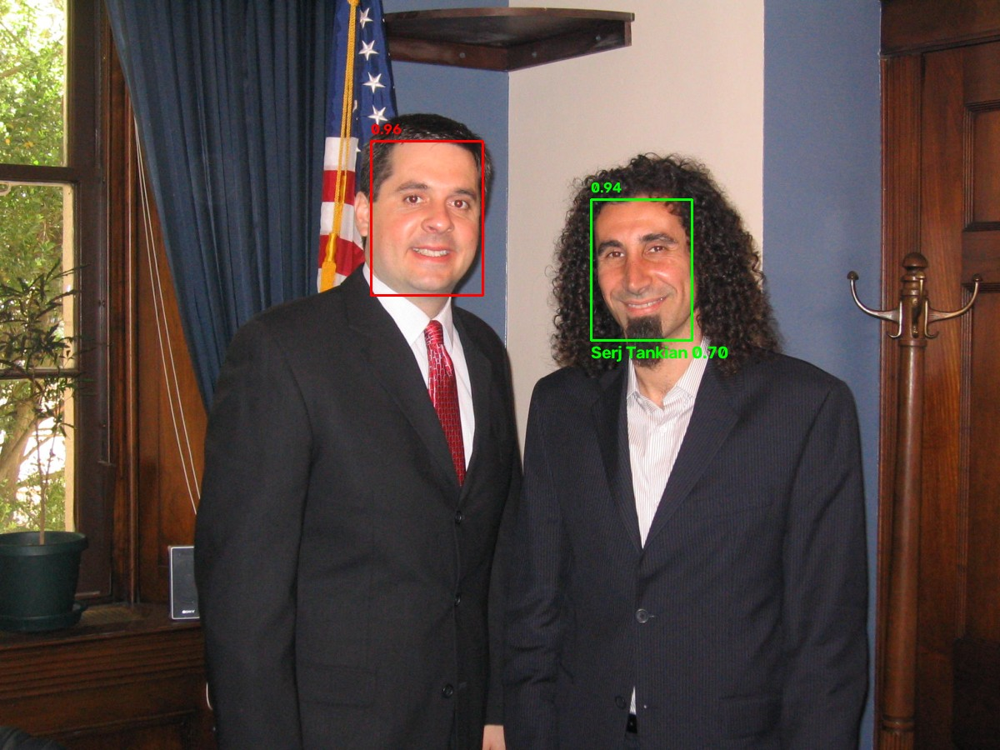

# face_recognition

Find faces, remember people, and recognize them live from a camera. It runs on a Mac or a Raspberry Pi.

- **Detection:** [YuNet](https://github.com/opencv/opencv_zoo/tree/main/models/face_detection_yunet) finds faces and gives each a confidence score.
- **Recognition:** [SFace](https://github.com/opencv/opencv_zoo/tree/main/models/face_recognition_sface) turns each face into 128 numbers that get compared to the people you enrolled.
- The models aren't stored in this repo. `setup.sh` downloads them.

---

## Demo



Serj Tankian was learned from 4 other freely licensed photos of him (see below) and recognized with a match score of **0.70**, shown in a **green** box with his name; anything at or above 0.363 counts as a match. The other person wasn't enrolled (match score 0.20), so he's a stranger: a **red** box with no name. The numbers above each box are face-detection scores. Default settings were used.

Serj's face was only used to make this picture and isn't stored in the repo or in any `known_faces.npz`.

Recognition depends on photo quality. Small faces, faces partly covered (e.g. by a microphone), and strong stage lighting can make a known person show up as `stranger`.

<details>
<summary>Photo credits</summary>

- Demo photo: [Devin Nunes with Serj Tankian](https://commons.wikimedia.org/wiki/File:Devin_Nunes_with_Serj_Tankian.jpg), Office of Congressman Devin Nunes, public domain. Resized to 1200 px wide; boxes and labels added by facerec.
- Photos used to learn Serj's face (not included in this repo), all from Wikimedia Commons:
  [Serj Tankian small.jpg](https://commons.wikimedia.org/wiki/File:Serj_Tankian_small.jpg) (Dark Apostrophe, CC BY-SA 3.0),
  [Serj Tankian Spirit of Burgas Bulgaria 2010 cropped.jpg](https://commons.wikimedia.org/wiki/File:Serj_Tankian_Spirit_of_Burgas_Bulgaria_2010_cropped.jpg) (Vladimir Petkov, CC BY-SA 2.0),
  [Serj Tankian in Armenia, 2011.jpg](https://commons.wikimedia.org/wiki/File:Serj_Tankian_in_Armenia,_2011.jpg) (Lgrigoryan, CC BY-SA 3.0),
  [Serj Tankian performing 2026.png](https://commons.wikimedia.org/wiki/File:Serj_Tankian_performing_2026.png) (Californipedia, CC0).

</details>

---

## Setup on a Mac

Requirements: Python 3 (e.g. `brew install python`) and git.

```bash
# 1. Get the code
git clone https://github.com/teacher57/facerec.git
cd face_recognition

# 2. Install everything: Python environment, OpenCV, both models, and the `facerec` command
#    (asks for your password once, to install facerec for all users in /usr/local/bin)
./setup.sh

# 3. Remember yourself, then test
facerec enroll_face --from-camera --name YourName
facerec test -v -j
```

The first time the camera opens, macOS asks whether your terminal app may use it. Click **Allow**, then run the command again. If you clicked "Don't Allow" before, turn it on under **System Settings → Privacy & Security → Camera**.

---

## Setup on a Raspberry Pi

Tested target: Raspberry Pi 4/5 running **Raspberry Pi OS Bookworm (64-bit)**. It works with a **USB webcam** or the **Pi Camera Module**.

> Note: the Pi path is written but hasn't been tested on real hardware yet.

```bash
# 1. Tools
sudo apt update
sudo apt install -y git

# 2. Get the code
git clone https://github.com/teacher57/facerec.git
cd face_recognition

# 3. Install everything. On a Pi, this also installs picamera2 with apt.
#    Asks for your sudo password (apt + installing facerec in /usr/local/bin)
./setup.sh
```

Check that the Pi sees the camera:

```bash
rpicam-hello --list-cameras     # Pi Camera Module
ls /dev/video*                  # USB webcam
```

### Enrolling people on a Pi without a screen

`enroll_face --from-camera` needs a window for its progress bar, so on a Pi with no screen use one of these instead:

```bash
# a) From a folder of photos (each photo should show only that person's face)
facerec enroll_face --from-file ~/photos/arnold --name Arnold

# b) Enroll on your Mac, then copy the face data to the Pi
scp known_faces.npz pi@<pi-address>:~/face_recognition/
```

Then start watching:

```bash
facerec run --log              # quiet; calls job.py
facerec run --rate 2 --log     # fewer checks per second if the Pi is slow
```

---

## All commands

`facerec` works from any folder, for every user on the machine.

```bash
facerec help                # all commands, with examples
facerec help COMMAND        # options for one command (same as: facerec COMMAND -h)
facerec run -h
```

### `facerec enroll_face` — remember a new person

| Command | What it does |
|---|---|
| `facerec enroll_face --from-camera` | Opens the camera and takes **15 shots, one every 0.5 s**, averaged into one face. Waits when there's no face and pauses when there's more than one. Shows a progress bar. **Ctrl+C** cancels without saving. |
| `facerec enroll_face --from-file FOLDER` | Uses every picture in `FOLDER` (`.jpg .jpeg .png .bmp .webp`) that has **exactly one face** and averages them. Other pictures are skipped with a reason. |

| Option | Meaning |
|---|---|
| `--name NAME` | Person's name. If left out, you're asked in the terminal. Enrolling an existing name **replaces** it. |
| `--camera auto\|usb\|picam` | Which camera to use (with `--from-camera`). Default `auto`. |

### `facerec list_faces` — list everyone you've enrolled

```
$ facerec list_faces
2 known people:
Arnold
Bernard
```

It only reads `known_faces.npz`. It doesn't open the camera or load the models, so it's instant.

### `facerec test` — try it out and see what's happening

At least one of `-v` or `-j` is required.

| Command | What it does |
|---|---|
| `facerec test -v` | Shows the camera in a window. Known people get a **green** box with their name and match score; strangers get a **red** box. The number above each box is the face-detection score. |
| `facerec test -j` | No window. Calls `job.py` and **prints every call** with a timestamp and the faces it received. |
| `facerec test -v -j` | Both: window plus printed job calls. |

Example `-j` output:

```
[13:05:01.234] job([{'name': 'Arnold', 'probability': 0.71, 'seen_for': 12}])
```

### `facerec run` — the real thing (no window, quiet)

Watches the camera and calls `job.py`. Nothing is displayed or printed per call. This is what a Pi would run all day.

### Options for `test` and `run`

| Option | Meaning |
|---|---|
| `--rate N` | Face checks per second (default `5`). Lower it on slow devices. The video itself always runs at full speed. |
| `--log` | Writes a **new log file** for this run in `logs/`, e.g. `logs/2026-10-07_13-05-01.log`, and **prints the same lines in the terminal**: one line per face per check, like `Arnold 0.71 2026-10-07 13:05:01.234` |
| `--camera auto\|usb\|picam` | `auto` (default) tries the Pi Camera Module first, then a USB or built-in camera. |

Stop `test` or `run` with **Ctrl+C** in the terminal.

---

## Your code: `job.py`

Edit `job.py` to decide what happens when faces are seen, then restart `run` or `test`.

```python
SLEEP_TIME_SEC = 2          # job runs at most once every 2 s (checks and logging keep going)


def job(faces):
    for face in faces:
        if face["name"] == "Arnold" and face["seen_for"] >= 5:
            print("Arnold here!")
```

`faces` is a list with one dict per face:

| Key | Meaning |
|---|---|
| `name` | Enrolled name, or `"stranger"` |
| `probability` | Match score for known people (cosine similarity; ≥ 0.363 counts as a match), face-detection score for strangers |
| `seen_for` | How many checks **in a row** this name has been seen; resets when it's missing. Use it to ignore one-off mistakes. All strangers share one count. |

`job` runs in the background, so a slow job (like sending a message) never freezes the camera. If the previous call is still running, the next one is skipped. Errors in `job` are printed and don't stop the program.

---

## Files

| File | Purpose |
|---|---|
| `setup.sh` | Installs everything and downloads the models |
| `face.py` | The commands (the `facerec` command runs it with the project's Python) |
| `job.py` | **Your** hook |
| `enroll.py` | Enrolling from the camera or a folder |
| `watch.py` | The camera loop behind `test` and `run` |
| `camera.py` | USB webcam and Pi Camera Module support |
| `face_detector.py` | YuNet: finding faces |
| `face_recognizer.py` | SFace: turning faces into numbers and matching them |

Created by `setup.sh` or at run time, and **never committed**: `.venv/`, `models/`, `logs/`, and `known_faces.npz`. That last file holds the enrolled faces, which is biometric data, so keep it private.

---

## Troubleshooting

| Problem | Fix |
|---|---|
| `Missing model files … Run setup.sh first` | Run `./setup.sh` in the project folder |
| `facerec: command not found` | Run `./setup.sh` again (it installs `/usr/local/bin/facerec`) |
| `facerec` stopped working after moving the project folder | Run `./setup.sh` again from the new location |
| `Could not open the USB/built-in camera` | Mac: allow the camera for your terminal app (see above). Pi: check `ls /dev/video*`. |
| `Could not open the Pi Camera Module` | Check the ribbon cable, then `rpicam-hello --list-cameras` |
| Your face shows as `stranger` | Enroll again in the same lighting you'll use, moving your head a little during capture |
| Slow on a Pi | Lower `--rate`, e.g. `--rate 2` |
| `git push` says `Permission denied (publickey)` | Run `gh auth setup-git` once, or add your SSH key to GitHub |

---

## Uninstall

```bash
sudo rm /usr/local/bin/facerec     # remove the command
rm -rf ~/path/to/face_recognition  # remove the project (including known_faces.npz)
```
